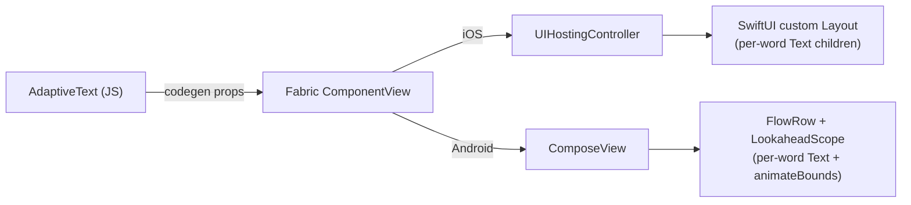

# React Native Adaptive Text — V1 Plan

## Goal

A `<AdaptiveText>` React Native component whose **words spring between lines** when the container resizes — using **SwiftUI Layout protocol** on iOS and **Jetpack Compose FlowRow + animateBounds** on Android. No JS animation work, no Reanimated dependency. The animation IS the OS.

## Architecture




The JS layer is intentionally thin: it tokenizes nothing, animates nothing. It forwards a string + style + animation config to native, and native owns layout AND motion. This is what makes the look indistinguishable from a real SwiftUI/Compose app.

## JS API

Public component (rename `AdaptiveTextView` → `AdaptiveText` for ergonomics; keep native class name `AdaptiveTextView` to avoid touching codegen names):

```tsx
<AdaptiveText
  style={{ fontSize: 24, fontWeight: '600', color: '#111', lineHeight: 32 }}
  animation={{ type: 'spring', damping: 18, stiffness: 220, mass: 1 }}
  splitBy="word"
  textAlign="start"
>
  When there is no more space for some words, those words smoothly fly to the next line.
</AdaptiveText>
```

Props (codegen-friendly, all serializable):

- `children: string` (or `text` prop as alternative — accept both, normalize in JS)
- `style`: subset of RN `TextStyle` forwarded as discrete native props (`fontSize`, `fontFamily`, `fontWeight`, `color`, `lineHeight`, `letterSpacing`, `textAlign`)
- `animation`: `{ type: 'spring', damping?, stiffness?, mass? } | { type: 'timing', duration?, easing? } | { type: 'none' }`
- `splitBy`: `'word' | 'grapheme'` (default `'word'`; grapheme for CJK / per-character flow)
- `accessibilityLabel`: defaults to the full string; per-word children are hidden from a11y tree
- All standard `ViewProps` (style for the container, layout, testID, etc.)

Files:

- [src/AdaptiveText.tsx](src/AdaptiveText.tsx) — public component, prop normalization, accessibility wiring
- [src/AdaptiveText.native.tsx](src/AdaptiveText.native.tsx) — re-exports the codegen component
- [src/AdaptiveTextNativeComponent.ts](src/AdaptiveTextNativeComponent.ts) — Fabric codegen spec (replaces `AdaptiveTextViewNativeComponent.ts`)
- [src/types.ts](src/types.ts) — public types
- [src/index.tsx](src/index.tsx) — `export { AdaptiveText } from './AdaptiveText'` and types

## iOS Implementation (SwiftUI)

Min target: **iOS 16** (SwiftUI Layout protocol). Document this clearly in README; older iOS users get a non-animated fallback (single SwiftUI `Text`).

Files (under [ios/](ios/)):

- `AdaptiveTextView.mm` — Fabric component view (Obj-C++), bridges codegen props
- `AdaptiveTextHostingView.swift` — wraps a `UIHostingController` and exposes `props` as `@ObservedObject`
- `AdaptiveTextFlowLayout.swift` — custom `Layout` conforming type that places per-word `Text` children left-to-right and wraps; recomputes on `proposal.width` change
- `AdaptiveTextContent.swift` — top-level SwiftUI view: `ForEach(words)` inside `AdaptiveTextFlowLayout`, with `.animation(animationCurve, value: containerWidth)` and `.animation(animationCurve, value: words)`

Key SwiftUI snippet (conceptual):

```swift
AdaptiveTextFlowLayout(alignment: alignment, spacing: spacing) {
    ForEach(Array(words.enumerated()), id: \.offset) { _, word in
        Text(word).font(font).foregroundColor(color)
    }
}
.animation(curve, value: containerWidth)
```

The animation "just works" because each `Text` child has stable identity and SwiftUI interpolates frame deltas between layout passes. This is exactly the WWDC 2022 "Compose custom layouts" demo, productionized.

## Android Implementation (Jetpack Compose)

Min: Compose BOM 2024.06+ (for stable `Modifier.animateBounds` + `LookaheadScope`).

Files (under [android/src/main/java/com/adaptivetext/](android/src/main/java/com/adaptivetext/)):

- `AdaptiveTextViewManager.kt` — Fabric `ViewManager` + codegen delegate
- `AdaptiveTextView.kt` — `FrameLayout` containing a `ComposeView`; exposes setters that mutate Compose `MutableState`
- `composables/AdaptiveTextFlow.kt` — composable that takes the props state and renders the flow

Key Compose snippet:

```kotlin
LookaheadScope {
    FlowRow(
        horizontalArrangement = Arrangement.spacedBy(spacing),
        verticalArrangement = Arrangement.spacedBy(lineSpacing),
    ) {
        words.forEach { word ->
            Text(
                text = word,
                style = textStyle,
                modifier = Modifier.animateBounds(this@LookaheadScope, spec)
            )
        }
    }
}
```

`animateBounds` is the Compose equivalent of SwiftUI's implicit layout animation — when constraints change, FlowRow recomputes positions and each `Text` smoothly animates to its new bounds.

## Comprehensive Example App

This is what the user explicitly asked for — show it working with all RN built-in containers. Replace the current single-screen [example/src/App.tsx](example/src/App.tsx) with a screen-list app (no React Navigation needed; a simple state-driven router keeps the example dependency-free).

Screens (each is its own file under `example/src/screens/`):

1. `01-ResizableContainer.tsx` — A draggable handle resizes a parent `View` from 100px to full width. Watch the text reflow in real time. **The hero demo.**
2. `02-AnimatedWidth.tsx` — Two buttons toggle the container width with `LayoutAnimation` / `Animated.timing`. Shows reflow synced with parent animation.
3. `03-Modal.tsx` — `<Modal>` with adaptive text in a body that animates between portrait/landscape sizes.
4. `04-ScrollView.tsx` — `<ScrollView>` with multiple paragraphs, plus a sticky header using AdaptiveText that reflows as the column width changes.
5. `05-FlatList.tsx` — Each row is an AdaptiveText; demonstrates correct measurement inside virtualized lists.
6. `06-DynamicContent.tsx` — Buttons add/remove/replace words; watch words enter, exit, and reflow smoothly.
7. `07-StyleMorph.tsx` — Sliders for `fontSize`, `letterSpacing`, `lineHeight` — text reflows live as glyph metrics change.
8. `08-RTL.tsx` — Toggle `I18nManager.forceRTL` (or pseudo-RTL via prop) and watch Arabic/Hebrew text flow correctly.
9. `09-AnimationConfig.tsx` — Pick spring/timing/none + tweak damping/stiffness/duration; instant feedback.
10. `10-Showcase.tsx` — A "fancy" composed demo: card with avatar + adaptive bio paragraph that reflows when the card expands on tap. The screenshot for the README.

App shell ([example/src/App.tsx](example/src/App.tsx)): a simple list of screen names → renders the selected screen with a back button. No router dep.

## Tooling & Cleanup

- Update [package.json](package.json):
  - `description`: "Native SwiftUI / Jetpack Compose-style fluid text reflow for React Native"
  - Add `keywords`: `swiftui`, `compose`, `flow`, `wrap`, `animation`, `layout`
  - Drop the unused `cpp` directory from `files` (we won't write C++)
- Update [README.md](README.md): hero GIF, install, min iOS/Android versions, full prop table, accessibility notes, performance notes
- Add a `lefthook` rule to lint Swift/Kotlin if convenient (optional)
- Keep `react-native-builder-bob` as-is

## Out of Scope (V2+)

Document these in README "Roadmap" but do NOT build:

- Per-word `onPress` / interactive words
- Exclusion paths / magazine flow
- Shared-element transitions across screens
- Web platform (Reanimated `LinearTransition` fallback would go here)
- Server-side measurement / FlashList height prediction (à la `expo-pretext`)

## Risks & Mitigations

- **Fabric Swift integration overhead**: RN 0.85 supports Swift component views via Obj-C++ trampolines, but it's still verbose. Mitigation: keep the `.mm` file purely as a thin codegen-prop forwarder; all logic lives in Swift.
- **Compose-in-Fabric measurement**: ComposeView inside a Fabric host can mismeasure during the first layout pass on Android. Mitigation: implement `requiresMeasurementOnLayout` and call `requestLayout()` in the FrameLayout's `onMeasure` hook.
- **Dynamic Type / Font Scale**: must call `UIFontMetrics.scaledValue` (iOS) and use `sp` units (Android Compose) to respect user accessibility settings. Verify in screen 07.
- **A11y on iOS**: SwiftUI per-word `Text` children all become VoiceOver elements unless you set `.accessibilityElement(children: .combine)` on the layout container with `.accessibilityLabel(fullString)`. This is critical and easy to miss.

## Project Structure (after the work)

```
src/
  AdaptiveText.tsx
  AdaptiveText.native.tsx
  AdaptiveTextNativeComponent.ts
  types.ts
  index.tsx
ios/
  AdaptiveTextView.mm
  AdaptiveTextHostingView.swift
  AdaptiveTextContent.swift
  AdaptiveTextFlowLayout.swift
android/src/main/java/com/adaptivetext/
  AdaptiveTextViewManager.kt
  AdaptiveTextView.kt
  composables/AdaptiveTextFlow.kt
example/src/
  App.tsx
  screens/01-ResizableContainer.tsx ... 10-Showcase.tsx
  components/Stage.tsx        # shared frame/wrapper for screens
  components/CodeSample.tsx   # display source under each demo
```

