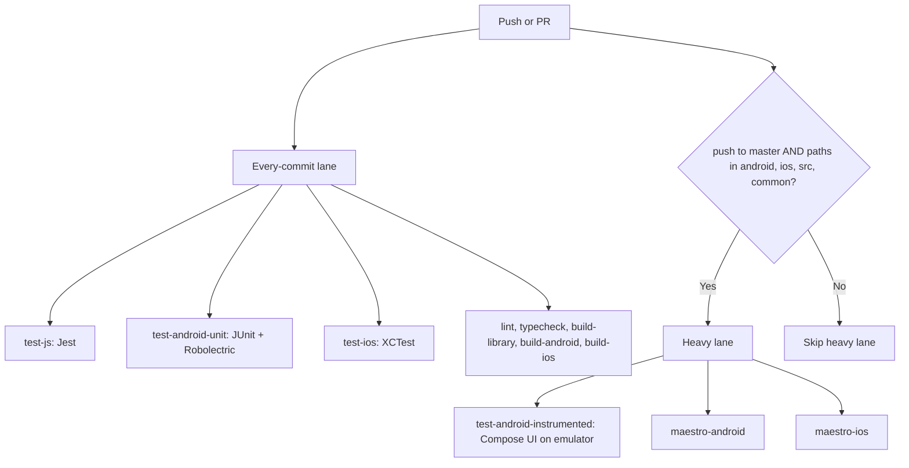

## Goals

1. Set up Jest at the library root (currently absent — only `example/jest.config.js` exists).
2. Add native unit tests on both platforms backed by shared fixtures so iOS and Android can never silently disagree.
3. Add the specific Compose UI test from the X tip — the smoking-gun guard for the §4.2 invariant in [AGENTS.md](AGENTS.md).
4. Add Maestro flows mirroring the §9 manual testing checklist.
5. Wire it all into [.github/workflows/ci.yml](.github/workflows/ci.yml) so every commit gets the cheap layers, and slow emulator/simulator layers gate to `master` + relevant paths only.
6. Update the existing branch references in [.github/workflows/ci.yml](.github/workflows/ci.yml) from `main` → `master` (the workflow currently watches `main` on lines 5 and 8 but the repo's default branch is `master`).

Out of scope (per discussion): Detox, SwiftUI snapshot tests.

---

## Layer 1 — JS unit tests with Jest at the library root

The root `package.json` has no `jest` config or `test` script today. Add Jest 30 + RN preset.

- New devDeps in [package.json](package.json):
  - `jest@^30`
  - `@types/jest@^30`
  - `@react-native/jest-preset@0.85.0` (matches RN version)
  - `@testing-library/react-native@^13`
  - `react-test-renderer@19.2.3`
- New script: `"test": "jest"`
- New `jest.config.js` at root:

```js
module.exports = {
  preset: '@react-native/jest-preset',
  testPathIgnorePatterns: ['/node_modules/', '/lib/', '/example/'],
  setupFilesAfterEach: ['<rootDir>/jest.setup.js'],
  transformIgnorePatterns: [
    'node_modules/(?!(react-native|@react-native|react-native-textflow)/)',
  ],
};
```

- New tests under `src/__tests__/`:
  - `AdaptiveText.test.tsx` — covers `splitStyle` (text-vs-view key partitioning), `normalizeFontWeight`, `normalizeTextAlign('justify') -> 'start'`, `coerceText` precedence (children > text > empty), and `accessibilityLabel` default-derives from text. Mocks `NativeAdaptiveText` so we don't need codegen output. Also has an explicit assertion for the §4.3 trap: passing an Animated `style.color` should not crash *the JSX render path* (we render and snapshot props).
  - `types.test.ts` — TypeScript-only `expectType` checks for `AdaptiveAnimationConfig` discrimination.

---

## Layer 2 — Shared JSON fixtures (cross-platform parity)

Single source of truth that locks the §4.4 tokenizer invariant.

- New `__fixtures__/tokenizer.json` shaped as:

```json
[
  {
    "name": "simple word split",
    "input": "Hello adaptive world",
    "splitBy": "word",
    "expected": [
      { "text": "Hello", "attachToPrevious": false },
      { "text": "adaptive", "attachToPrevious": false },
      { "text": "world", "attachToPrevious": false }
    ]
  },
  { "name": "trailing punctuation attaches", "input": "Hello, world!", ... },
  { "name": "CJK grapheme split", "input": "你好世界", "splitBy": "grapheme", ... },
  { "name": "empty string", "input": "", ... },
  ...
]
```

Consumed by both Kotlin and Swift unit tests below. If iOS and Android disagree, exactly one suite goes red.

---

## Layer 3 — Android JVM unit tests (fast, no emulator)

- Add to [android/build.gradle](android/build.gradle):

```gradle
android {
  testOptions { unitTests.includeAndroidResources = true }
}
dependencies {
  testImplementation "junit:junit:4.13.2"
  testImplementation "org.jetbrains.kotlin:kotlin-test-junit:2.0.21"
  testImplementation "org.robolectric:robolectric:4.13"
  testImplementation "com.google.truth:truth:1.4.4"
}
```

- New `android/src/test/java/com/adaptivetext/`:
  - `compose/AdaptiveTextTokenizerTest.kt` — loads `../../../../../__fixtures__/tokenizer.json`, parametrised over each fixture entry, asserts [AdaptiveTextTokenizer.kt](android/src/main/java/com/adaptivetext/compose/AdaptiveTextTokenizer.kt) output is identical.
  - `measurer/AdaptiveTextNativeMeasurerCacheTest.kt` — Robolectric test that calls the measurer twice with the same `(font, token)` and asserts the second call returns from the per-token cache (uses a shaper-call counter or measures elapsed time bound).

---

## Layer 4 — Android Compose UI instrumented test (the X-tipped one)

This is the smoking-gun guard for §4.2 in [AGENTS.md](AGENTS.md), pinning the [AdaptiveTextView.kt](android/src/main/java/com/adaptivetext/AdaptiveTextView.kt) `MATCH_PARENT` invariant.

- Add to [android/build.gradle](android/build.gradle):

```gradle
android {
  defaultConfig { testInstrumentationRunner "androidx.test.runner.AndroidJUnitRunner" }
}
dependencies {
  androidTestImplementation "androidx.test:core:1.6.1"
  androidTestImplementation "androidx.test:runner:1.6.2"
  androidTestImplementation "androidx.test.ext:junit:1.2.1"
  androidTestImplementation "androidx.compose.ui:ui-test-junit4"
  androidTestImplementation "androidx.compose.ui:ui-test-manifest"
}
```

- New `android/src/androidTest/java/com/adaptivetext/AdaptiveTextViewHeightTest.kt`:

```kotlin
@RunWith(AndroidJUnit4::class)
class AdaptiveTextViewHeightTest {

  @Test
  fun composeViewHeightTracksYogaHeightAcrossPropChange() {
    val activity = launchEmptyComposeActivity()
    val view = AdaptiveTextView(activity)
    val parent = FrameLayout(activity).apply { addView(view) }
    activity.setContentView(parent)
    waitForAttach(view)

    val w = 886
    val hComfortable = 497
    val hCompact = 332

    view.applyRenderProps(propsWithPreset("comfortable"))
    measureExact(view, w, hComfortable)
    assertThat(view.composeViewMeasuredHeight()).isEqualTo(hComfortable)

    view.applyRenderProps(propsWithPreset("compact"))
    measureExact(view, w, hCompact)
    assertThat(view.composeViewMeasuredHeight()).isEqualTo(hCompact)

    view.applyRenderProps(propsWithPreset("comfortable"))
    measureExact(view, w, hComfortable)
    assertThat(view.composeViewMeasuredHeight()).isEqualTo(hComfortable)  // §4.2 regression line
  }
}
```

- We'll add a small visible-for-test accessor `composeViewMeasuredHeight()` (or `@VisibleForTesting val composeView`) to [AdaptiveTextView.kt](android/src/main/java/com/adaptivetext/AdaptiveTextView.kt). The current `private val composeView` would need a `@get:VisibleForTesting` opening — minimal, surgical change.

---

## Layer 5 — iOS XCTest target in the example project

User chose: add a Swift XCTest target in [example/ios/AdaptiveTextExample.xcodeproj](example/ios/AdaptiveTextExample.xcodeproj). Approach:

- Use the `xcodeproj` ruby gem (already pulled in via CocoaPods) to programmatically add a `AdaptiveTextExampleTests` target to the existing pbxproj. This is more reliable than hand-editing the file. Ship a small `example/ios/scripts/add_test_target.rb` that's idempotent.
- New `example/ios/AdaptiveTextExampleTests/`:
  - `AdaptiveTextTokenizerTests.swift` — reads `../../../__fixtures__/tokenizer.json`, runs [AdaptiveTextTokenizer.swift](ios/AdaptiveTextTokenizer.swift), asserts parity with the Kotlin side via the same fixture.
  - `AdaptiveTextMeasurerTests.swift` — exercises [AdaptiveTextMeasurer.mm](ios/AdaptiveTextMeasurer.mm) clamping behaviour (§4.1.5: returned size respects `constraints.minimumSize`/`maximumSize`) and the `lineHeight` floor (§4.1.4).
- Update Podfile to expose the TextFlow pod to the new test target.
- Run via `xcodebuild test -workspace AdaptiveTextExample.xcworkspace -scheme AdaptiveTextExampleTests -destination 'platform=iOS Simulator,name=iPhone 15'`.

---

## Layer 6 — Maestro E2E flows

- Install `maestro` (1.40+) — usually via a `setup-maestro` GitHub Action; no npm dep.
- New `.maestro/` directory:
  - `01-resizable-drag.yaml` — slowly drags screen 1's resize handle full-range, screenshots at intervals.
  - `04-scrollview-preset-toggle.yaml` — toggles compact ↔ comfortable on screen 4 three times, asserts last-line visibility via screenshot diff.
  - `07-stylemorph-fontsize.yaml` — drags fontSize slider 12→36→12 on screen 7.
  - `11-theme-toggle.yaml` — light → dark → light → dark → light on screen 11.
- New scripts in [package.json](package.json):
  - `"maestro:android": "maestro test .maestro --include-tags=android"`
  - `"maestro:ios": "maestro test .maestro --include-tags=ios"`

---

## Layer 7 — CI updates ([.github/workflows/ci.yml](.github/workflows/ci.yml))

Per user spec: cheap layers run on every commit; emulator/simulator layers gate to `master` branch only AND only when `android/`, `ios/`, or `src/` changed.

**Branch rename, first.** The current workflow's top-level triggers reference `main`:

```yaml
on:
  push:
    branches:
      - main          # → master
  pull_request:
    branches:
      - main          # → master
```

Both occurrences (lines 5 and 8 in the existing file) flip to `master` in the same commit as the new test jobs land. Without this, none of the existing jobs (lint, build-library, build-android, build-ios) actually fire on the user's working branch.

New jobs:

1. `**test-js**` (runs every commit, ubuntu-latest)
  - `yarn install` → `yarn test --coverage` → upload codecov artifact.
2. `**test-android-unit**` (runs every commit, ubuntu-latest)
  - JDK 17 → `./gradlew :react-native-textflow:test` (pure JVM, no emulator).
3. `**test-ios**` (runs every commit, macos-latest)
  - Reuses existing iOS setup → `xcodebuild test -scheme AdaptiveTextExampleTests`.
  - Cheap (no full app build needed; just the test target + its pod deps).
4. `**test-android-instrumented**` (gated: master + paths filter) — runs the Compose UI test on emulator via `reactivecircus/android-emulator-runner@v2`. Trigger:

```yaml
on:
  push:
    branches: [master]
    paths: ['android/**', 'ios/**', 'src/**', 'common/**']
  workflow_dispatch:
```

5. `**maestro-android**` (gated: master + paths filter) — boots emulator, installs example app debug APK, runs `.maestro/` flows. Same trigger as #4.
6. `**maestro-ios**` (gated: master + paths filter, macos-latest) — boots simulator, runs flows. Same trigger.

The existing `lint`, `build-library`, `build-android`, `build-ios` jobs stay as-is structurally — only their top-level `branches: [main]` flips to `branches: [master]`.




---

## Notes / risks

- The Compose UI test asserts exact pixel heights (`497`, `332`). Those numbers are device-DPI dependent. We'll parametrise: ask the measurer for `comfortable` and `compact` heights at the test's actual width on the test device, then assert *that* value comes back through the ComposeView, not hard-coded constants.
- The `xcodeproj` gem-based test-target injection is a small piece of meta-tooling — the alternative is hand-editing `project.pbxproj`, which is brittle. The script will be ~50 lines and idempotent.
- Maestro flows that compare screenshots need a baseline. First CI run will record baselines as artifacts; subsequent runs diff against them.
- Total CI time on every-commit lane: roughly +60-90s (Jest is fast, JVM unit tests are fast, XCTest reuses the iOS macos-latest runner).
- Total CI time on heavy lane (master only): +15-25 min. Acceptable given gating.
- Latest versions used everywhere: Jest 30, @testing-library/react-native 13, JUnit 4.13.2 (Compose-test compatible), Robolectric 4.13, Truth 1.4.4, Maestro latest, `reactivecircus/android-emulator-runner@v2`.

